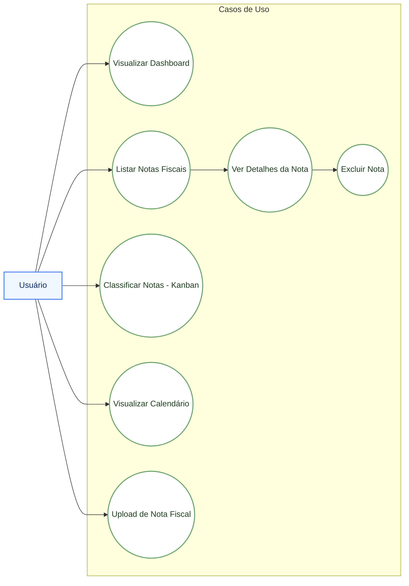
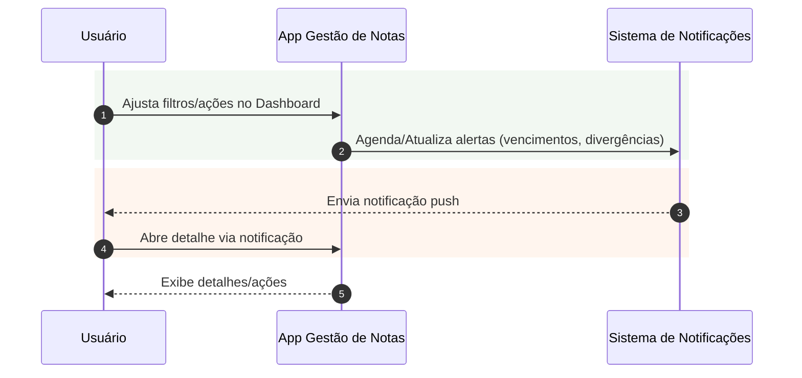

# Diagramas de Casos de Uso

Os diagramas abaixo descrevem os atores e seus casos de uso principais no aplicativo. Utiliza-se Mermaid para representação.

## Atores
- Usuário (Gestor Financeiro)
- Sistema de Notificações (externo)

## Casos de Uso do Usuário

## Interações com Sistema de Notificações

## Escopo dos Casos
- Visualizar Dashboard: visão geral, filtros e navegação.
- Listar Notas Fiscais: página de index com ações por item.
- Ver Detalhes da Nota: atributos da NF e ação de exclusão.
- Excluir Nota: confirmação e remoção.
- Classificar Notas: movimentar cartões entre colunas.
- Visualizar Calendário: totais por dia e lançamentos do mês.
- Upload de Nota Fiscal: seleção de arquivo, CNPJ opcional e processamento.
