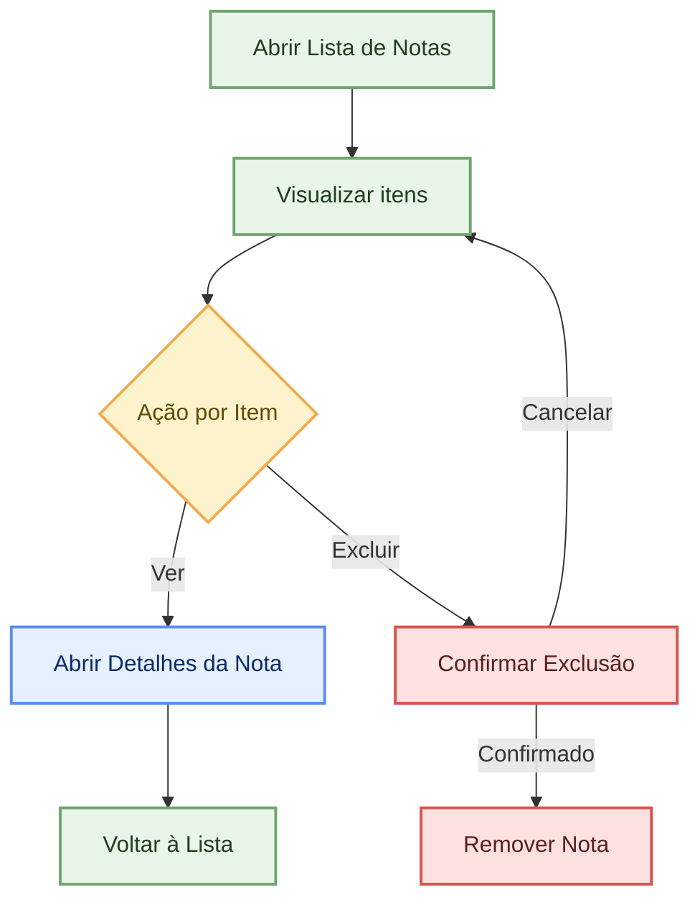
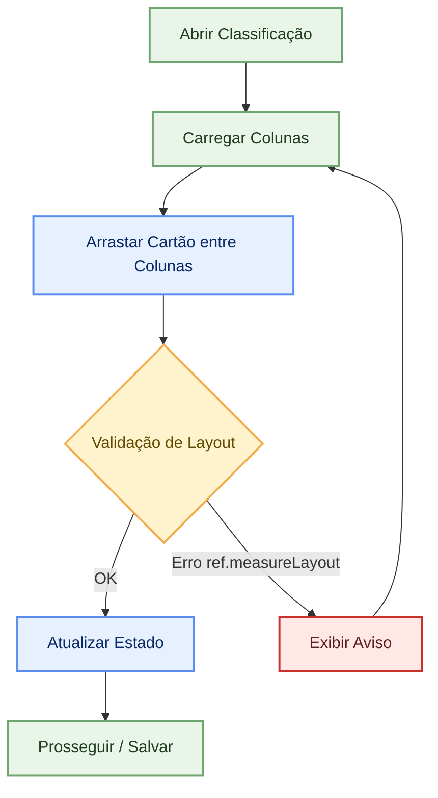
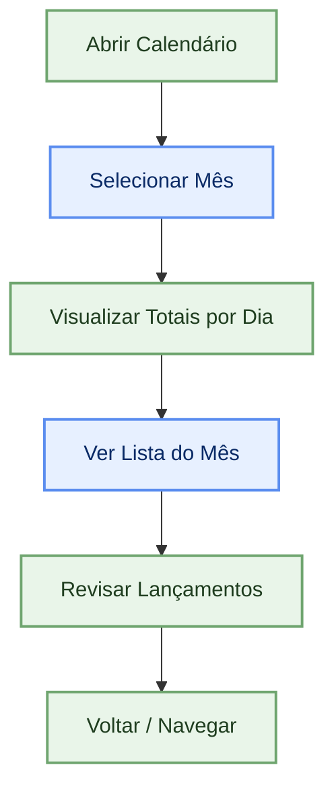
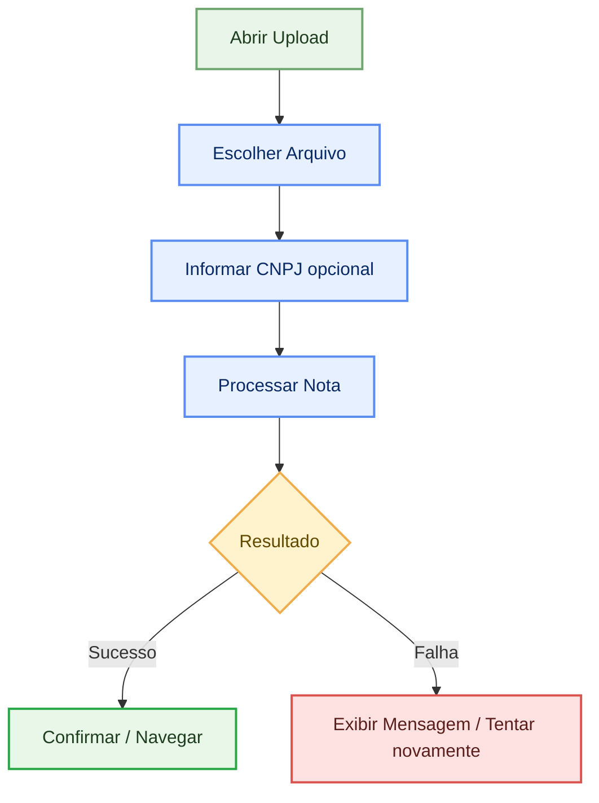

# Fluxogramas de Funcionalidades

Os fluxos abaixo descrevem, em alto nível, como o usuário interage com as principais funcionalidades do app. Diagramas em Mermaid podem ser visualizados nativamente em várias plataformas.

## Dashboard

```mermaid
%% Tema moderno e estilização
flowchart TD
    classDef primary fill:#e9f5e9,stroke:#6fa56f,stroke-width:2px,color:#1f3d1f,corner-radius:8px
    classDef decision fill:#fff3cd,stroke:#f0ad4e,stroke-width:2px,color:#614a00,corner-radius:8px
    classDef action fill:#e7f0ff,stroke:#5b8def,stroke-width:2px,color:#0a2a66,corner-radius:8px
    classDef end fill:#fde2e1,stroke:#d9534f,stroke-width:2px,color:#5a1e1c,corner-radius:8px

    A[Abrir App]:::primary --> B[Carregar Dashboard]:::primary
    B --> C[Aplicar Filtros]:::action
    C --> D{Escolher Seção}:::decision
    D -->|Notas Recentes| E[Ir para Detalhes de Nota]:::action
    D -->|Pagar| F[Abrir Tela de Contas a Pagar]:::action
    D -->|Receber| G[Abrir Tela de Contas a Receber]:::action
    D -->|Upload| H[Abrir Tela de Upload]:::action
    E --> I[Voltar ao Dashboard]:::primary
    F --> I
    G --> I
    H --> I
```

## Notas Fiscais: Listar e Ver Detalhes



## Classificar Notas (Kanban)



## Calendário de Lançamentos



## Upload de Nota Fiscal


